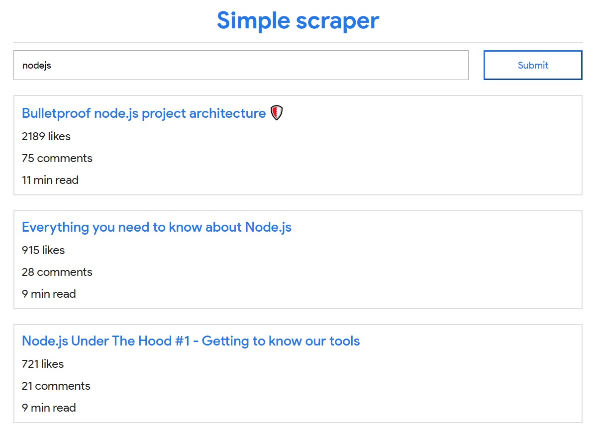

# Nodejs simple web scraper with react ssr

## Instruction
1. Run command `yarn` to  install all the dependencies
2. Run command `yarn start` to start to project
3. Launch browser with new page in `locahost:3000`
4. Enjoy!

## Screenshot

